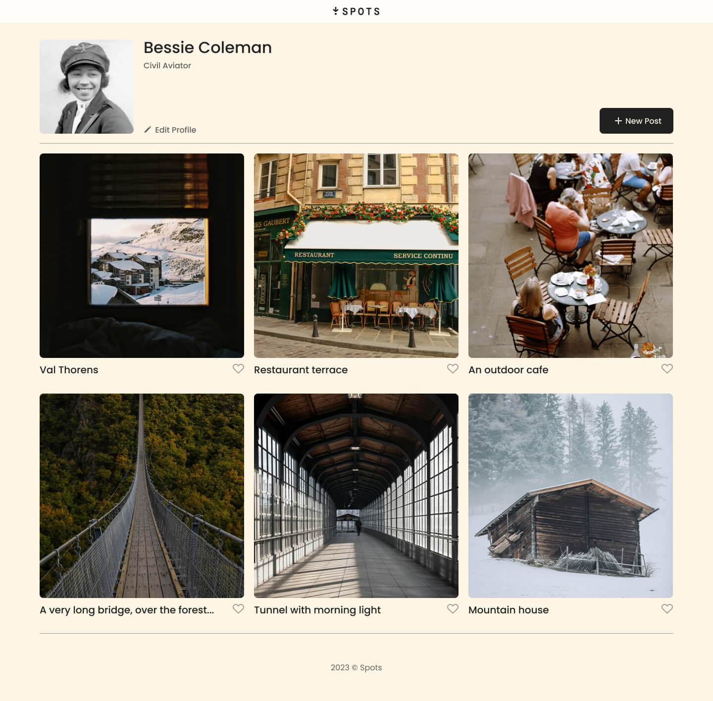
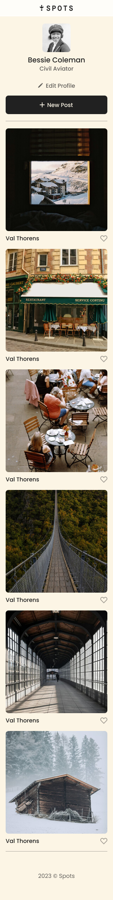

# Project 3: Spots

### Overview

- Intro
- Figma
- Images

**Intro**

This project is made so all the elements are displayed correctly on popular screen sizes.

**Figma**

- [Link to the project on Figma](https://www.figma.com/file/BBNm2bC3lj8QQMHlnqRsga/Sprint-3-Project-%E2%80%94-Spots?type=design&node-id=2%3A60&mode=design&t=afgNFybdorZO6cQo-1)

## Project features

- Semantic HTML5
- Flexbox
- Grid
- Positioning
- Flat BEM file structure
- Responsive design
- Desktop, tablet and mobile design

**Images**

**Project**

- [Link to the project](https://anandragothaman.github.io/se_project_spots/)
